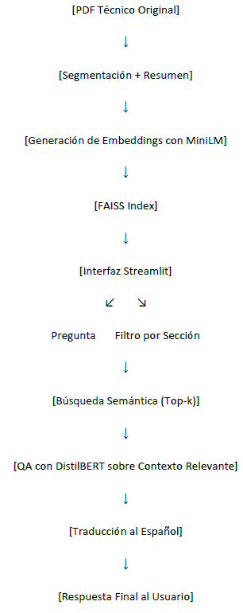
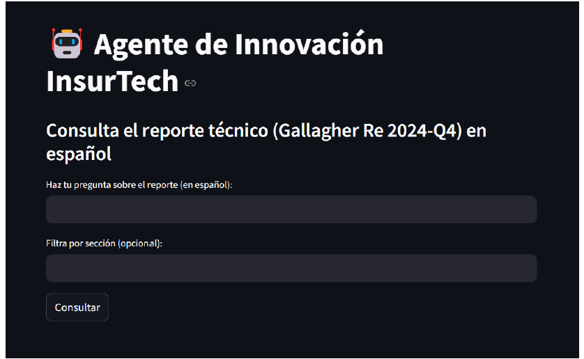

# 🤖 Agente Inteligente de Consulta Técnica con IA Generativa (RAG)

Proyecto de inteligencia artificial aplicada al análisis automático y consulta contextual de informes técnicos en inglés, con respuestas en español.

---

## 🎯 Objetivo

Permitir la consulta en lenguaje natural de documento complejos específicos del sector asegurador, facilitando su interpretación.

---

## 🧰 Herramientas

- Python
- Streamlit (interfaz)
- SentenceTransformers (MiniLM embeddings)
- FAISS (búsqueda semántica)
- Hugging Face (DistilBERT Q&A)
- Deep-Translator (traducción inglés → español)
- CSV (como base de conocimiento vectorial)

---

## 🧠 Arquitectura
[PDF Original]
↓ Embeddings con MiniLM
↓ FAISS Index
↓ QA con DistilBERT
↓ Traducción automática
↓ Respuesta al usuario vía Streamlit

---

## 🔍 Funcionalidades

- Ingreso de preguntas en español o inglés
- Filtro por sección del documento
- Visualización del contexto usado para responder
- Traducción automática al español

---

## 📊 Evaluación

- Tiempo de respuesta: ~2.5s
- Precisión aceptable con preguntas multilingües
- Limitaciones: contexto limitado, sin memoria conversacional

---

## 🖼️ Capturas del Proyecto

<h3>Arquitectura de Solución</h3>

<h3>Interfaz Solución</h3>

<h3>Ejemplo de Pregunta</h3> 

---

## 📂 Archivos clave

